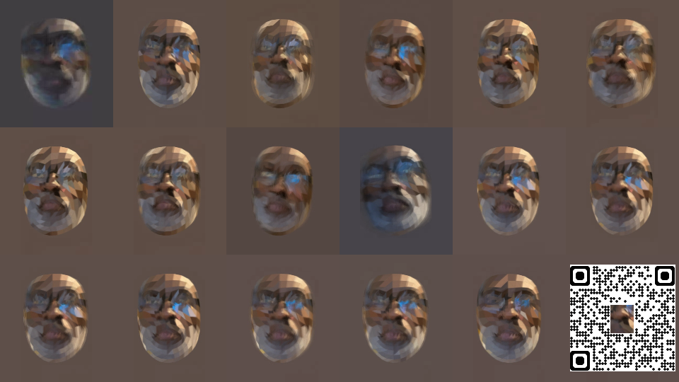
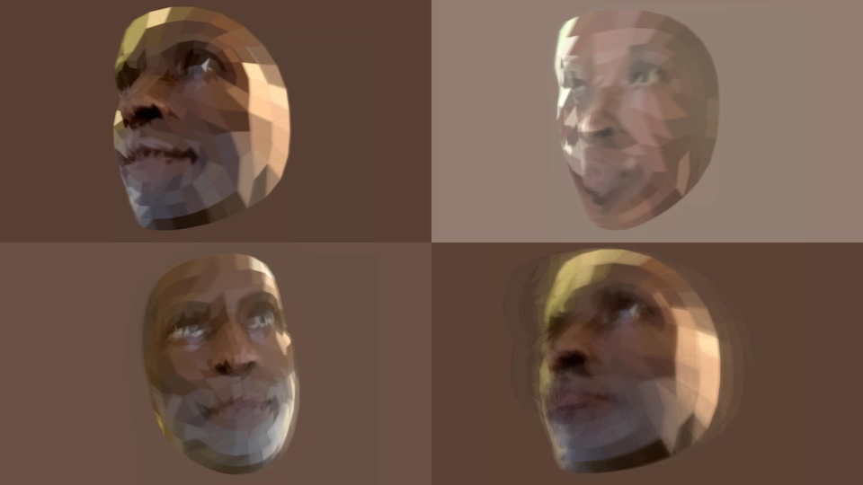
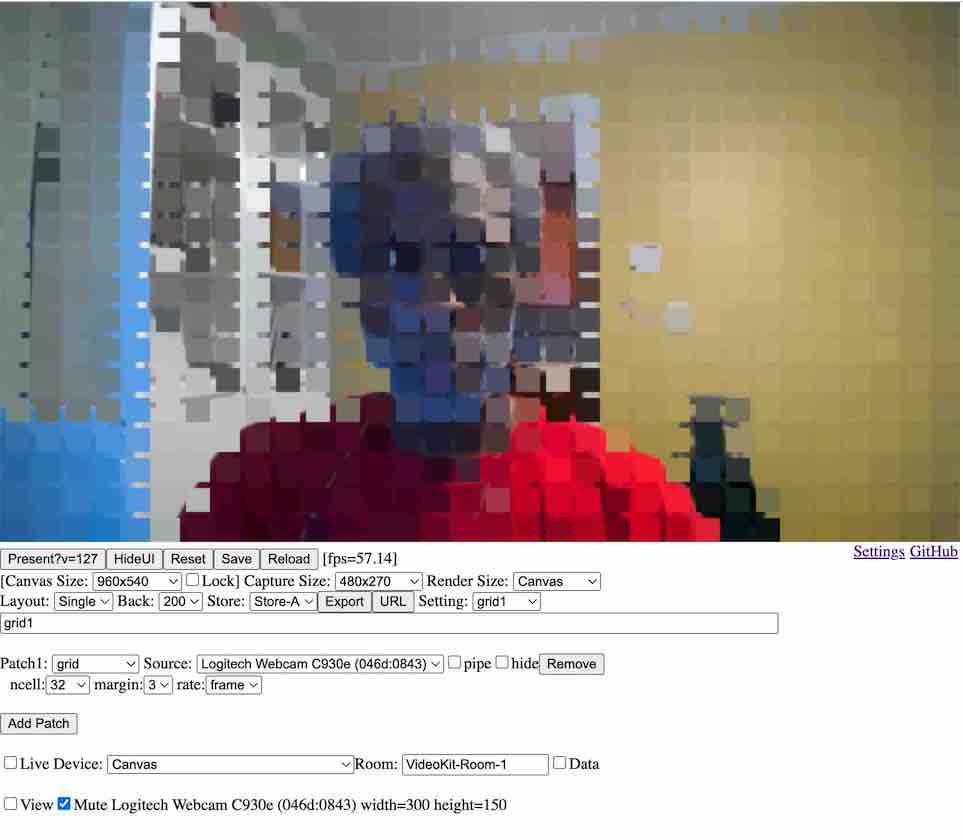
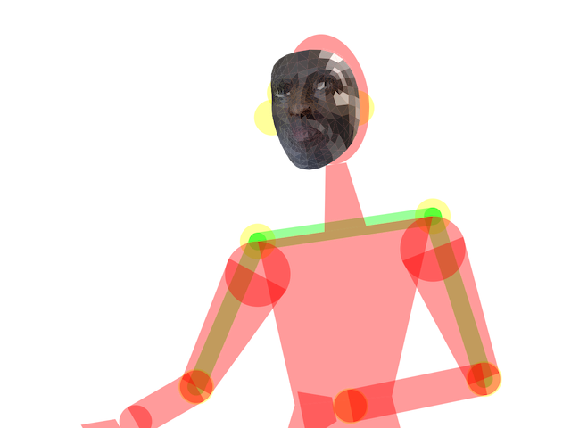
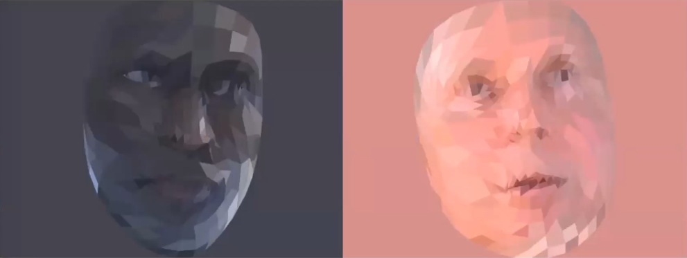
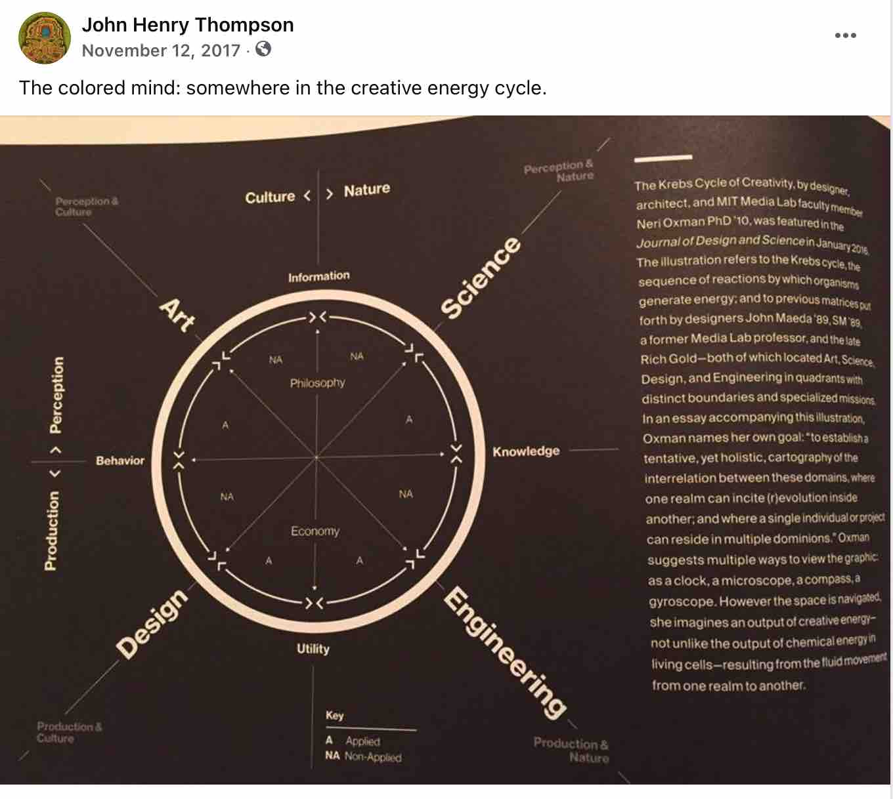
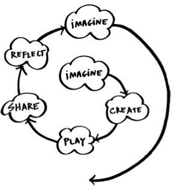
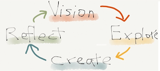
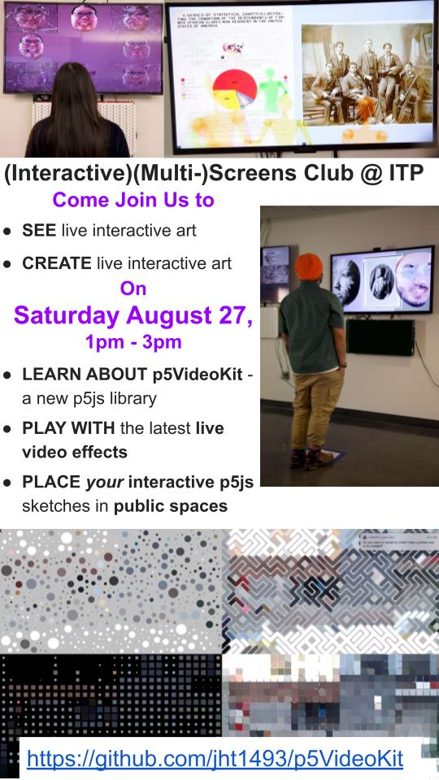

# [p5videoKit](https://github.com/molab-itp/p5videoKit.git)

<!-- https://github.com/jht1493/p5videoKit -->

p5videoKit - a Library and dashboard for mixing video in the browser.

- [demo](https://jht1493.net/p5videoKit/demo/)
- You can apply visual effects
  to live video from connected cameras or streaming from other devices on the internet.
  p5videoKit is designed to be re-usable and extended
  with your own p5js code for visual effects and interaction.

The code and documentation is in development.
We welcome your feedback and help to improve the user interface and documentation.

- started as code for interactive installation at [NYU-ITP Brooklyn 2021](https://jht1493-gmail.github.io/2021-NYU-ITP-Installation)

- re-mixing effects code from
  [DICE mobile app](https://jht1493.net/johnhenrythompson/3-dice.html) and
  [NYU-ITP ICM course](https://github.com/ITPNYU/ICM-2021-Code)
- [video overview](https://youtu.be/6t9aiVLL9OQ)
- contact me: [create an github issue for this repo](https://github.com/jht9629-nyu/p5videoKit/issues)

## Screen shots

Screen shots of p5videoKit in action:






[Colored Portraits Installation @ 370 Jay St. Brooklyn 2021](https://jht1493-gmail.github.io/2021-NYU-ITP-Installation/colored.html)

## Demo

p5videoKit runs best in modern desktop browsers. I've tested primarily in Google Chrome and second on Apple Safari on MacOS desktop computers. On mobile devices (iPhone and Android) things are flaky - landscape mode is best here.

[demo](https://jht1493.net/p5videoKit/demo/) - Opens a new browser window to with videokit interface that shows local camera.Your browser should ask you for permission to use the camera and microphone. Hit the Reset button if you don't see any video. Use the Effect drop down to select an effect to apply to the camera video.

[Grid demo](https://jht1493.net/p5videoKit/demo/?d=videoKit/settings/demo/grid1.json) - pixelized video effect.



[4 effects demo](https://jht1493.net/p5videoKit/demo/?d=videoKit/settings/demo/effects4.json) - four effects and be seen in a 2 by 2 layout. Use the Effect drop down to select an effect.

[live-tile-3x6-face-mesh](https://jht1493.net/p5videoKit/demo/index.html?u=7&d=settings/live-tile-3x6-face-mesh.json) - 3x6 live tiling of images from mobile devices

[live1](https://jht1493.net/p5videoKit/demo/?d=videoKit/settings/baked/live1.json) - joint the VideoKit-Play-1 live streaming room.

[archive of settings ](https://jht1493.net/p5videoKit/demo/videoKit/settings.html) - not every settings work

## The interface

- TODO: document Effects UI

## The code

- moving beyond the p5js web editor
- setup a free [github account ](https://github.com/)
- download this repo with [github disktop app](https://desktop.github.com/)
- run local server using
  [Visual Studio Code text editor](https://code.visualstudio.com/)
  with extensions:
  [p5.vscode+Live Server](https://marketplace.visualstudio.com/items?itemName=samplavigne.p5-vscode)
- local server starting point:
  - ./src/index.html
- TODO: running locally setup
- TODO: adding settings via Export button
- TODO: adding effects code

## Live streaming

- Live Device check box enables live stream to all other instances using the same room name.

## History

- p5videoKit is based of the code used to create the interactive installation at [NYU-ITP in 2021](https://jht1493.github.io/2021-NYU-ITP-Installation/)

- Keeping in the groove of my [DICE video art app](https://jht1493.net/johnhenrythompson/3-dice.html)

  - **Distributed Instruments for Computed Expression**

## Components

Built using

- [p5js](https://p5js.org)
- [ml5js](https://ml5js.org)
- [p5LiveMedia](https://github.com/vanevery/p5LiveMedia)



[](https://en.wikipedia.org/wiki/Neri_Oxman)



# archived from 2020

## Announcements -- archived

### (Interactive)(Multi)Screens Club presentation -- archived



# --

```
# --
2025-11-11 18:01:29
p5-video-kit@0.0.19
build_ver 423
bin/a-release.sh
build_ver 424

# --
2025-10-21 16:55:10

bin/lib-publish.sh

- p5-video-kit@0.0.17

# --

?v=415

bin/lib-publish.sh

- p5-video-kit@0.0.16

# --

bin/a-release.sh

open https://jht1493.net/p5videoKit/demo2
```
