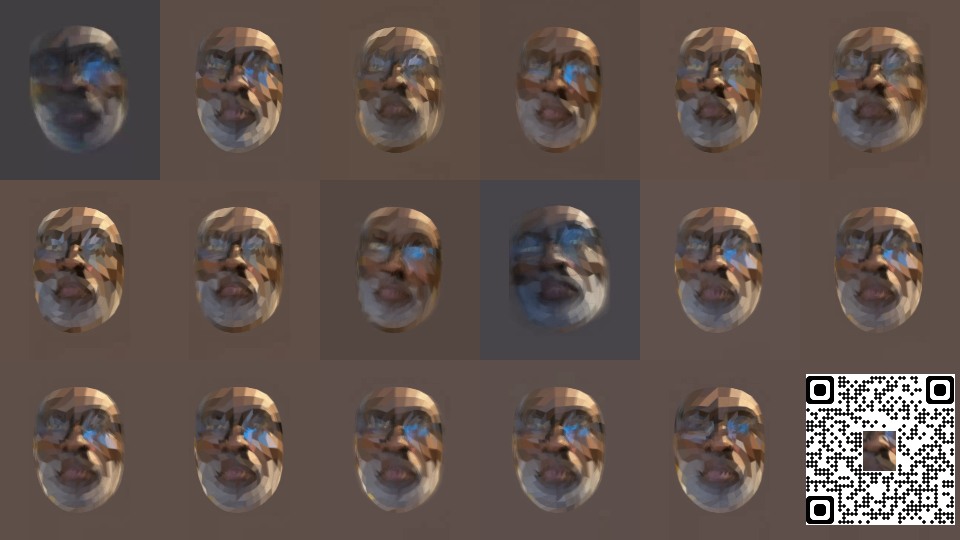
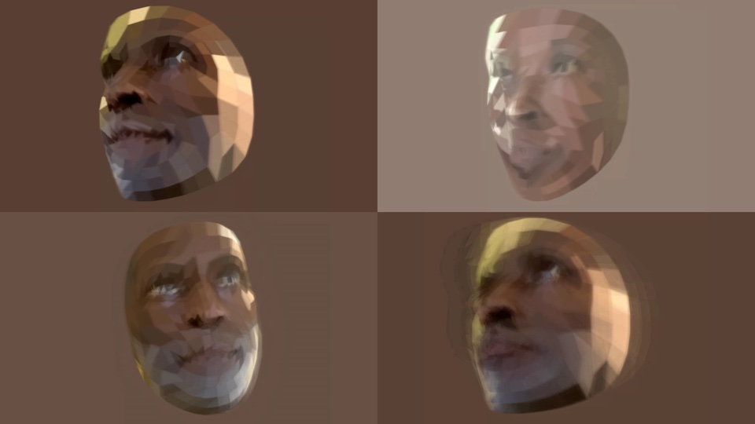
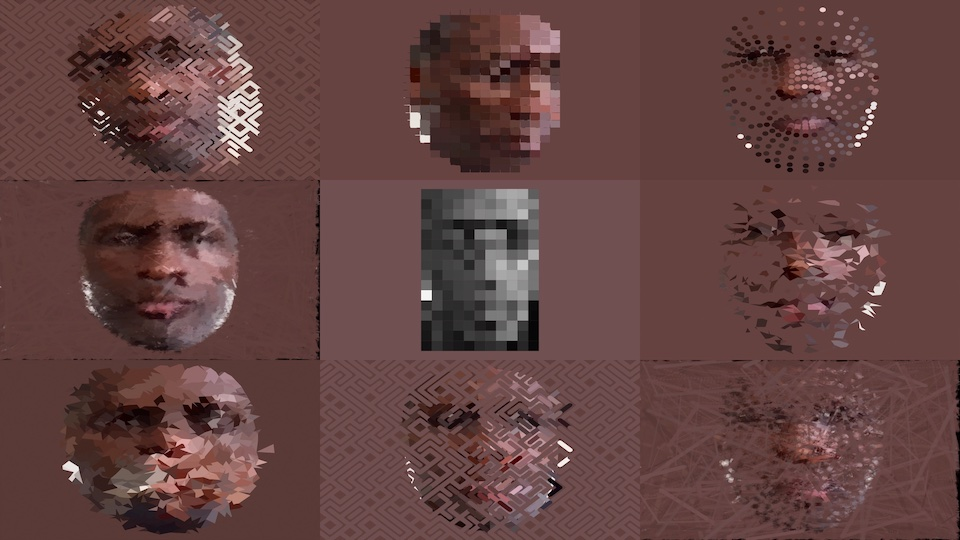
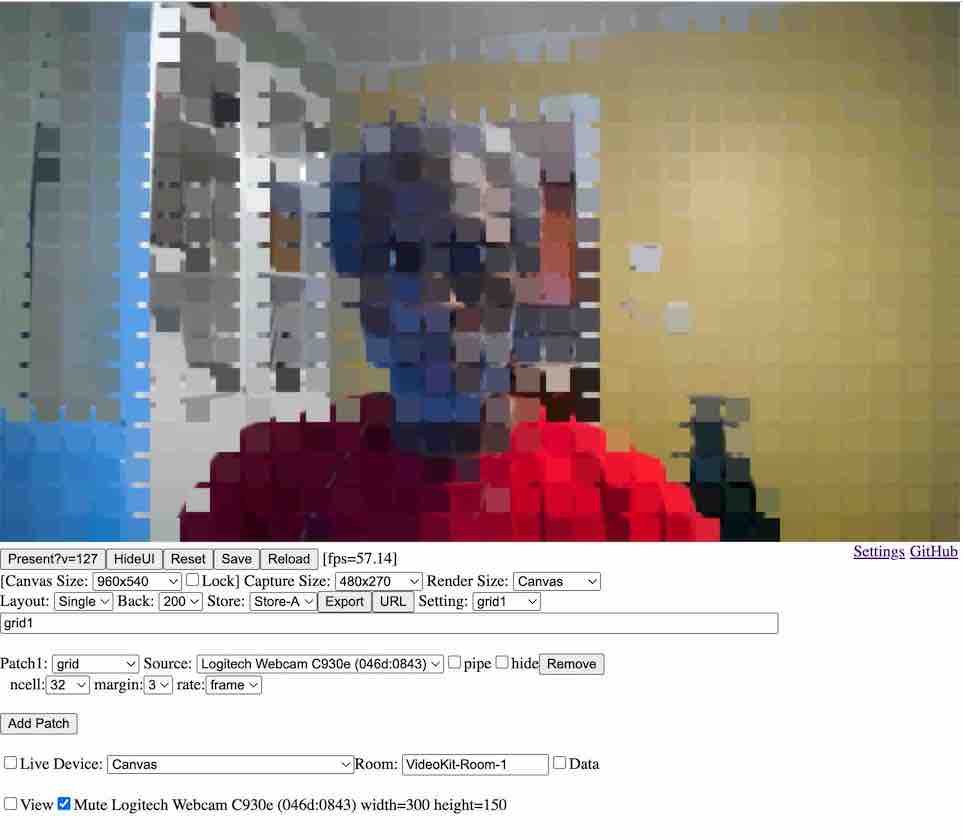
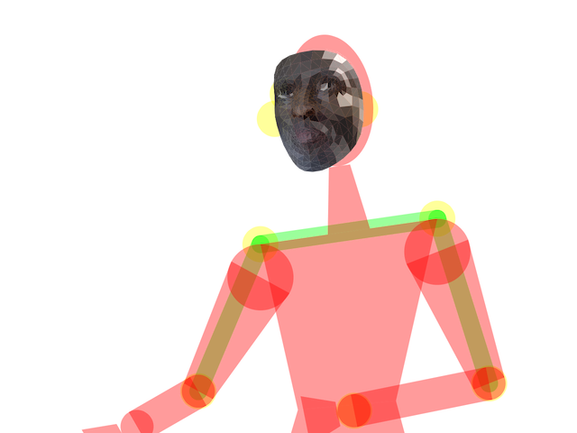
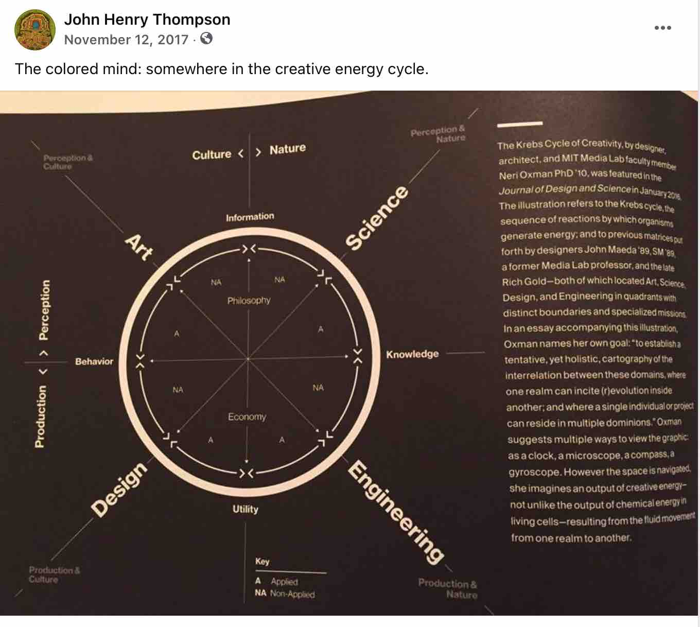
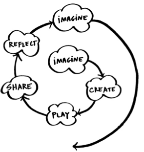
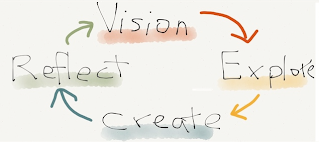
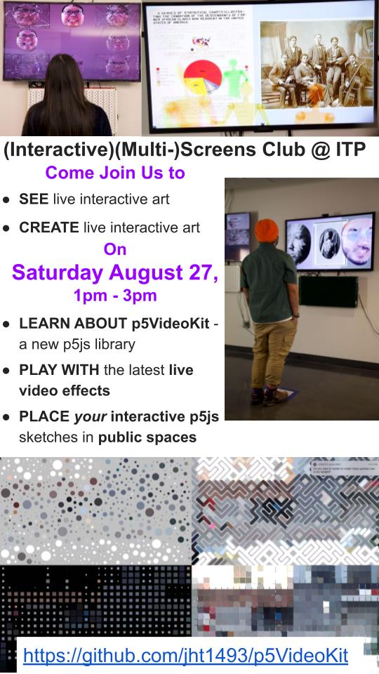

# [p5videoKit](https://github.com/molab-itp/p5videoKit.git)

<!-- https://github.com/jht1493/p5videoKit -->

p5videoKit - a Library and dashboard for mixing video in the browser.

- [demo](https://jht1493.net/p5videoKit/demo/)
- You can apply visual effects
  to live video from connected cameras or streaming from other devices on the internet.
  p5videoKit is designed to be re-usable and extended
  with your own p5js code for visual effects and interaction.

The code and documentation is in development.
We welcome your feedback and help to improve the user interface and documentation.

- started as code for interactive installation at [NYU-ITP Brooklyn 2021](https://jht1493-gmail.github.io/2021-NYU-ITP-Installation)

- re-mixing effects code from
  [DICE mobile app](https://jht1493.net/johnhenrythompson/3-dice.html) and
  [NYU-ITP ICM course](https://github.com/ITPNYU/ICM-2021-Code)
- [video overview](https://youtu.be/6t9aiVLL9OQ)
- contact me: [create an github issue for this repo](https://github.com/jht9629-nyu/p5videoKit/issues)

## Screen shots

Screen shots of p5videoKit in action:







[Colored Portraits Installation @ 370 Jay St. Brooklyn 2021](https://jht1493-gmail.github.io/2021-NYU-ITP-Installation/colored.html)

## Demo

p5videoKit runs best in modern desktop browsers. I've tested primarily in Google Chrome and second on Apple Safari on MacOS desktop computers. On mobile devices (iPhone and Android) things are flaky - landscape mode is best here.

[demo](https://jht1493.net/p5videoKit/demo/) - Opens a new browser window to with videokit interface that shows local camera.Your browser should ask you for permission to use the camera and microphone. Hit the Reset button if you don't see any video. Use the Effect drop down to select an effect to apply to the camera video.

[Grid demo](https://jht1493.net/p5videoKit/demo/?d=videoKit/settings/demo/grid1.json) - pixelized video effect.



[4 effects demo](https://jht1493.net/p5videoKit/demo/?d=videoKit/settings/demo/effects4.json) - four effects and be seen in a 2 by 2 layout. Use the Effect drop down to select an effect.

[live-tile-3x6-face-mesh](https://jht1493.net/p5videoKit/demo/index.html?u=7&d=settings/live-tile-3x6-face-mesh.json) - 3x6 live tiling of images from mobile devices

[live1](https://jht1493.net/p5videoKit/demo/?d=videoKit/settings/baked/live1.json) - joint the VideoKit-Play-1 live streaming room.

[archive of settings ](https://jht1493.net/p5videoKit/demo/videoKit/settings.html) - not every settings work

## The interface

- TODO: document Effects UI

## The code

- moving beyond the p5js web editor
- setup a free [github account ](https://github.com/)
- download this repo with [github disktop app](https://desktop.github.com/)
- run local server using
  [Visual Studio Code text editor](https://code.visualstudio.com/)
  with extensions:
  [p5.vscode+Live Server](https://marketplace.visualstudio.com/items?itemName=samplavigne.p5-vscode)
- local server starting point:
  - ./src/index.html

## Live streaming

- Live Device check box enables live stream to all other instances using the same room name.

## History

- p5videoKit is based of the code used to create the interactive installation at [NYU-ITP in 2021](https://jht1493.github.io/2021-NYU-ITP-Installation/)

- Keeping in the groove of my [DICE video art app](https://jht1493.net/johnhenrythompson/3-dice.html)
  - **Distributed Instruments for Computed Expression**

## Components

Built using

- [p5js](https://p5js.org)
- [ml5js](https://ml5js.org)
- [p5LiveMedia](https://github.com/vanevery/p5LiveMedia)



[](https://en.wikipedia.org/wiki/Neri_Oxman)



# archived from 2020

## Announcements -- archived

### (Interactive)(Multi)Screens Club presentation -- archived



# NOTES

```
# --
2026-04-23 05:39:37

bin/build.sh
npm login

# --
2026-04-22 21:54:46
https://www.npmjs.com/settings/jht9629/profile

2026-04-18 14:20:14
?v=433
640x480 for pose_net to align with face_mesh
npm login
bin/lib-publish.sh
+ p5-video-kit@0.0.30
bin/pub-p5videoKit-html.sh

# --
2026-04-17 04:55:05
eff_bestill MISSING input
Must enable Audio and make noise for face_band, fft_graph, fft_polar
bin/lib-publish.sh
v0.0.26
!!@ Required
npm login
p5-video-kit@0.0.27
bin/a-release.sh
build_ver 430
bin/lib-publish.sh
!!@ Must be done again to get build ver in interface
p5-video-kit@0.0.28
!!@ May have to wait few minutes to see new lib
bin/pub-p5videoKit-html.sh

# --
2025-11-12 15:35:39
bin/a-release.sh
bin/lib-publish.sh
+ p5-video-kit@0.0.21
bin/a-release.sh

# --
2025-11-12 12:56:03
webdb
https://github.com/jht1493-gmail/webdb
745,516,244 bytes (752.9 MB on disk) for 497 items

# --
2025-11-11 18:01:29
p5-video-kit@0.0.19
build_ver 423
bin/a-release.sh
build_ver 424
bin/lib-publish.sh
p5-video-kit@0.0.20
build_ver 426


```

## Done

[x] MazeSpin
https://jht1493.net/p5videoKit/demo2/
https://jht1493.net/p5videoKit/demo2/index.html?u=
2&d=settings/2x2-maze-spin-alpha-2-line-truchet.json

[x]
http://127.0.0.1:5501/src/index.html?u=2&d=videoKit/settings/2021/0-facet-hd.json
Uncaught (in promise) TypeError: Cannot read properties of undefined (reading 'patch_index1')
at eff_loop.trigger_step (eff_loop.js:100:29)

[x]
http://127.0.0.1:5501/src/index.html?u=8&d=videoKit/settings/2021/covid-ticker.json
Uncaught (in promise) SyntaxError: Unexpected token '<', "<!doctype "... is not valid JSON

## TODO

- [] mobile: fps update causes flicker
- [] Full test local, then server
  http://127.0.0.1:5501/src/videoKit/settings.html
- inputBlind --> skip ready check
  - protect all input
- doc all effects with source link
- eff_pose_net use output layer
- scrub security key - reset repo
- revive p5videoKitPrivate
- ml5@1.2.0
  <script src="https://unpkg.com/ml5@1.2.0/dist/ml5.min.js"></script>
- TODO: running locally setup
- TODO: adding settings via Export button
- TODO: adding effects code
- [ ] use CDN for libs - confirm load performance

## BUGS

- [] image
  GET http://127.0.0.1:5501/src/external/media/webdb/covid19m/undefined 404 (Not Found)
- []
  http://127.0.0.1:5501/src/index.html?u=9&d=videoKit/settings/2021/covid19m.json
  Uncaught (in promise) TypeError: Cannot read properties of undefined (reading 'length')
  at eff_image_show.load_image (eff_image.js:305:38)
  at eff_image_show.init (eff_image.js:132:10)
- [] bodypix.segment fails
  this.bodypix.segment(this.video, (error, results) => {
- [] Error after re-init effect
